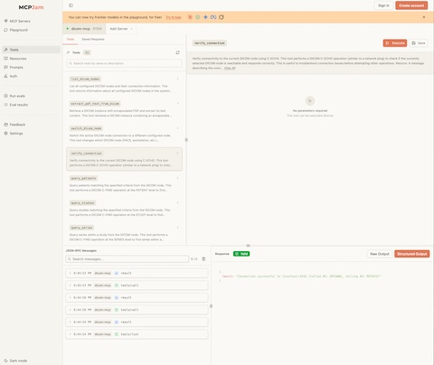

# DICOM MCP Server - Medical Imaging AI Integration 🏥

[](https://opensource.org/licenses/MIT)
[](https://github.com/modelcontextprotocol/python-sdk)
[](https://www.mcpjam.com)

Cloned from:  <https://github.com/ChristianHinge/dicom-mcp> and modified.

This version uses [MCP Jam](https://www.mcpjam.com) exclusively for development, testing, and LLM integration.

Enables AI assistants to query, read, and move data on PACS using the standard Model Context Protocol (MCP), with Orthanc as the reference implementation.  You can use your own APIKEY (e.g. for ChatGPT) and run it locally for development using ChatGPT as the LLM.

## ✨ Core Capabilities

`dicom-mcp` provides tools to:

* **🔍 Query Orthanc**: Search for patients, studies, series, and instances using various criteria.
* **📄 Read DICOM Reports (PDF)**: Retrieve DICOM instances containing encapsulated PDFs (e.g., clinical reports) and extract the text content.
* **➡️ Send DICOM Images**: Send series or studies to other DICOM destinations, e.g. AI endpoints for image segmentation, classification, etc.
* **⚙️ Utilities**: Manage connections and understand query options.
* **⚙️ FHIR methods**:
* **⚙️ Mini- RIS**:

## 🚀 Quick Start

### 📥 Installation

Install using pip by cloning the repository:

```bash
# Clone and set up development environment
gh repo clone sscotti/dicom-mcp
cd dicom-mcp

# Create and activate virtual environment
python3 -m venv venv
source venv/bin/activate

# Install with dependencies
pip install -e ".[dev]"
```

### ⚙️ Configuration

`dicom-mcp` requires a YAML configuration file (`configuration.yaml` or similar) defining DICOM nodes and calling AE titles. Adapt the configuration or keep as is for compatibility with the sample ORTHANC  Server.

```yaml
# DICOM nodes configuration
nodes:
  main:
    host: "localhost"
    port: 4242
    ae_title: "ORTHANC"
    description: "Local Orthanc DICOM server (Primary)"
  
  secondary:
    host: "localhost"
    port: 4243
    ae_title: "ORTHANC2"
    description: "Local Orthanc DICOM server (Secondary)"

current_node: "main"
calling_aet: "MCPSCU"

# FHIR server configuration (optional)
# You can configure multiple FHIR servers and switch between them
fhir_servers:
  firely:
    base_url: "https://server.fire.ly"
    description: "Firely FHIR Test Server (public, no API key needed)"
  
  siim:
    base_url: "https://hackathon.siim.org/fhir"
    api_key: "${SIIM_API_KEY}"  # Set in .env file
    description: "SIIM Hackathon FHIR server"
  
  # Uncomment to use a local HAPI FHIR server
  hapi_local:
    base_url: "http://localhost:8080/fhir"
    description: "Local HAPI FHIR server"

current_fhir: "hapi_local"  # Active FHIR server: firely, siim, or hapi_local, make sure to start the local hapi fhir server before starting the MCP server

# The server will expose all DICOM tools and FHIR tools via standard MCP protocol

# Mini-RIS MySQL database configuration (optional)
mini_ris:
  host: "localhost"
  port: 3306
  user: "orthanc_ris_app"
  password: "${MINI_RIS_DB_PASSWORD}"
  database: "orthanc_ris"
  pool_size: 5
```

> [!WARNING]
> DICOM-MCP is not meant for clinical use, and should not be connected with live hospital databases or databases with patient-sensitive data. Doing so could lead to both loss of patient data, and leakage of patient data onto the internet. DICOM-MCP can be used with locally hosted open-weight LLMs for complete data privacy.
>
> [!NOTE]
> This project uses **MCP Jam exclusively** for all development, testing, and LLM integration needs. The `mcp-config.example.json` file is provided as a template with relative paths that you can adapt to your setup.  That can be imported as JSON into MCPJAM to configure the interface.

### Docker Container Setup (Orthancs, FHIR, PostGres and MySQL)

```bash
docker-compose up -d
pytest # uploads dummy pdf data to ORTHANC server
```

UI at [http://localhost:8042](http://localhost:8042) and [http://localhost:8043](http://localhost:8043)

HAPI FHIR will be available at [http://localhost:8080/fhir](http://localhost:8080/fhir)

See [FHIR Servers Guide](tests/FHIR_SERVERS.md) for detailed configuration options including Firely test server and SIIM integration.

### 🔌 Using with MCP Jam

**MCP Jam** is the recommended tool for testing and exploring your DICOM MCP server. It offers an interface with **Guest Mode** for immediate testing without any setup.

**Start MCP Jam:**

```bash
# Navigate to your dicom-mcp directory
cd /path/to/dicom-mcp

# Activate your virtual environment
source venv/bin/activate

# Start MCP Jam
npx -y @mcpjam/inspector@latest or npx -y @mcpjam/inspector@beta
```

**Setup Server in MCP Jam:**

1. **Click "Guest Mode"** in the MCP Jam interface (no account required)
2. **Add Server Manually** with these settings, or import `mcp-config.example.json` as a template:
   * **Server Name**: `DICOM MCP`
   * **Command**: `{path_to_venv}/bin/python` (e.g., `venv/bin/python` or absolute path)
   * **Arguments**: `-m dicom_mcp configuration.yaml --transport stdio`
   * **Environment Variables**:
     * Name: `PYTHONPATH`
     * Value: `src` (relative) or absolute path to `src` directory
   * **Working Directory**: Path to your dicom-mcp project root

**Example Configuration (macOS/Linux):**

* **Command**: `/absolute/path/to/dicom-mcp/venv/bin/python`
* **Arguments**: `-m dicom_mcp configuration.yaml --transport stdio`
* **Environment Variable**: `PYTHONPATH` = `/absolute/path/to/dicom-mcp/src`

**MCP Jam Interface:**



**Configure LLM in MCP Jam:**

1. Go to the **Settings** tab
2. Add your API keys for LLM providers:
   * **OpenAI** - For GPT-4, GPT-4o, o1, etc.
   * **Anthropic** - For Claude 3.5 Sonnet, Claude Opus, etc.
   * **Google Gemini** - For Gemini 2.5 Pro, Flash, etc.
   * **Deepseek** - For Deepseek Chat, Reasoner
   * **Ollama** - Auto-detects local models (no API key needed)
3. Go to the **Playground** tab to start chatting with your DICOM server

**System Prompt:**

For better LLM interactions, you can configure a system prompt in MCP Jam's Playground tab. A template is available in `system_prompt.txt` - copy it into the system prompt field when starting a new session.

> **Note**: MCP Jam Guest Mode may not persist system prompts between sessions. Keep `system_prompt.txt` handy to copy-paste when needed.

**MCP Jam Features:**

* ✅ **Guest Mode**: No account required - start testing immediately
* ✅ **Beautiful UI**: Modern interface with AI provider logos
* ✅ **Easy Setup**: Simple server configuration with clear forms
* ✅ **Real-time Testing**: Interactive tool execution with immediate results
* ✅ **Full Functionality**: Access to all 11 DICOM tools
* ✅ **LLM Playground**: Test your DICOM server with various LLMs
* ✅ **Community Driven**: Active development with regular updates

**MCP Jam Tabs:**

* **Servers Tab**: Manage and connect to your DICOM MCP server
* **Tools Tab**: Browse and test all 11 DICOM tools interactively
* **Playground Tab**: Chat with your DICOM server using configured LLMs
* **Settings Tab**: Configure API keys and LLM providers

**Available DICOM Tools:**

* `verify_connection` - Test DICOM connectivity
* `list_dicom_nodes` - Show configured servers
* `query_patients` - Search for patients
* `query_studies` - Find studies by criteria
* `query_series` - Locate series within studies
* `query_instances` - Find individual DICOM images
* `extract_pdf_text_from_dicom` - Extract text from DICOM PDFs
* `move_series` / `move_study` - Transfer DICOM data
* `switch_dicom_node` - Change active server
* `get_attribute_presets` - Show query detail levels

**Available FHIR Tools (when FHIR is configured):**

* `verify_fhir_connection` - Test FHIR server connectivity
* `list_fhir_servers` - List configured FHIR servers
* `fhir_search_patient` - Search for Patient resources
* `fhir_search_imaging_study` - Search for ImagingStudy resources
* `fhir_read_resource` - Read any FHIR resource by type and ID
* `fhir_create_resource` - Create new FHIR resources (Patient, ImagingStudy, ServiceRequest, etc.)
* `fhir_update_resource` - Update existing FHIR resources

See [FHIR Servers Guide](tests/FHIR_SERVERS.md) for configuration details.

### 🧪 Synthetic Data for Testing

To test orchestration workflows, populate your local HAPI FHIR server with synthetic data:

```bash
# Start HAPI FHIR server (if not already running)
docker-compose -f tests/docker-compose-fhir.yaml up -d

# Populate synthetic data
python tests/populate_synthetic_fhir_data.py
```

This creates:

* 5 test patients with realistic demographics
* ServiceRequests (orders) for imaging studies
* ImagingStudies linked to patients
* DiagnosticReports with findings

See [Orchestration Guide](ORCHESTRATION.md) for workflow examples using this data.

### 🔄 Orchestration Workflows

The MCP server enables end-to-end radiology workflows combining FHIR and DICOM:

* **Order Entry**: Create ServiceRequest in FHIR
* **Study Acquisition**: Link DICOM studies to FHIR ImagingStudies
* **Reporting**: Generate DiagnosticReports from DICOM PDFs
* **Workflow Management**: Track orders through completion

See [ORCHESTRATION.md](ORCHESTRATION.md) for detailed workflow examples and patterns.

## 🛠️ Tools Overview

`dicom-mcp` provides four categories of tools for interaction with DICOM servers and DICOM data.

### 🔍 Query Metadata

* **`query_patients`**: Search for patients based on criteria like name, ID, or birth date.
* **`query_studies`**: Find studies using patient ID, date, modality, description, accession number, or Study UID.
* **`query_series`**: Locate series within a specific study using modality, series number/description, or Series UID.
* **`query_instances`**: Find individual instances (images/objects) within a series using instance number or SOP Instance UID

### 📄 Read DICOM Reports (PDF)

* **`extract_pdf_text_from_dicom`**: Retrieve a specific DICOM instance containing an encapsulated PDF and extract its text content.

### ➡️ Send DICOM Images

* **`move_series`**: Send a specific DICOM series to another configured DICOM node using C-MOVE.
* **`move_study`**: Send an entire DICOM study to another configured DICOM node using C-MOVE.

### ⚙️ Utilities

* **`list_dicom_nodes`**: Show the currently active DICOM node and list all configured nodes.
* **`switch_dicom_node`**: Change the active DICOM node for subsequent operations.
* **`verify_connection`**: Test the DICOM network connection to the currently active node using C-ECHO.
* **`get_attribute_presets`**: List the available levels of detail (minimal, standard, extended) for metadata query results.

### Example interaction

The tools can be chained together to answer complex questions:

<div align="center">

</div>

## 📈 Contributing

### Running Tests

Tests require a running Orthanc DICOM server. You can use Docker:

```bash
# Navigate to the directory containing docker-compose.yml (e.g., tests/)
cd tests
docker-compose up -d
```

Run tests using pytest:

```bash
# From the project root directory
pytest
```

Stop the Orthanc container:

```bash
cd tests
docker-compose down
```

### 🔧 Development & Debugging

**MCP Jam** is the recommended tool for development, testing, and debugging your DICOM MCP server.

**Development Workflow:**

1. **Start Orthanc**: `cd tests && docker-compose up -d`
2. **Load test data**: `pytest` (uploads sample DICOM data)
3. **Start MCP Jam**: `npx -y @mcpjam/inspector@latest`
4. **Test tools**: Use the Tools tab to test all DICOM operations interactively
5. **Test with LLMs**: Use the Playground tab to test natural language interactions
6. **Debug issues**: Check Server Notifications for errors and detailed logging

**Benefits of MCP Jam for Development:**

* ✅ **Guest Mode** - No account required, works immediately
* ✅ **Real-time testing** of all DICOM tools with immediate feedback
* ✅ **Interactive interface** for exploring DICOM data and responses
* ✅ **LLM integration** - Test how AI assistants interact with your server
* ✅ **Debug logging** - View detailed server notifications and errors
* ✅ **Tool browser** - Easily discover and test all available tools

## 🙏 Acknowledgments

* Built using [pynetdicom](https://github.com/pydicom/pynetdicom)
* Uses [PyPDF2](https://pypi.org/project/PyPDF2/) for PDF text extraction
