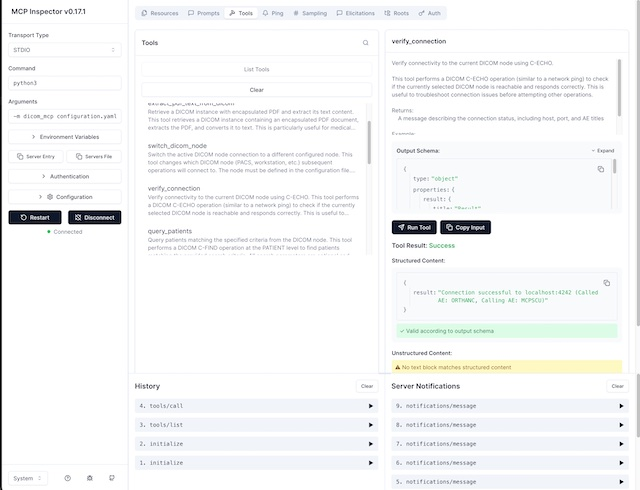

# MCP Integrated with Orthanc and OpenAI ChatGPT 🏥

[](https://opensource.org/licenses/MIT)
[](https://www.python.org/downloads/)
 [](https://pypi.org/project/dicom-mcp/)
 [](https://pypi.org/project/dicom-mcp/)  
 <https://github.com/modelcontextprotocol/python-sdk>

 Forked from:  <https://github.com/ChristianHinge/dicom-mcp>

 The forked version has been modified to incorporate:  <https://github.com/modelcontextprotocol/inspector> for development and testing.

 See also:  npx -y @mcpjam/inspector@latest

<https://www.mcpjam.com/>

The `dicom-mcp` server enables AI assistants (like OpenAI ChatGPT) to query, read, and move data on DICOM servers (PACS, VNA, etc.), with Orthanc as the reference implementation.

```text
---------------------------------------------------------------------
🧑‍⚕️ User: "Any significant findings in John Doe's previous CT report?"

🧠 LLM → ⚙️ Tools:
   query_patients → query_studies → query_series → extract_pdf_text_from_dicom

💬 LLM Response: "The report from 2025-03-26 mentions a history of splenomegaly (enlarged spleen)"

🧑‍⚕️ User: "What's the volume of his spleen at the last scan and the scan today?"

🧠 LLM → ⚙️ Tools:
   (query_studies → query_series → move_series → query_series → extract_pdf_text_from_dicom) x2
   (The move_series tool sends the latest CT to a DICOM segmentation node, which returns volume PDF report)

💬 LLM Response: "last year 2024-03-26: 412cm³, today 2025-04-10: 350cm³"
---------------------------------------------------------------------
```

## ✨ Core Capabilities

`dicom-mcp` provides tools to:

* **🔍 Query Metadata**: Search for patients, studies, series, and instances using various criteria.
* **📄 Read DICOM Reports (PDF)**: Retrieve DICOM instances containing encapsulated PDFs (e.g., clinical reports) and extract the text content.
* **➡️ Send DICOM Images**: Send series or studies to other DICOM destinations, e.g. AI endpoints for image segmentation, classification, etc.
* **⚙️ Utilities**: Manage connections and understand query options.

## 🚀 Quick Start

### 🎯 Two Ways to Use DICOM-MCP

**Option A: MCP Inspector (Free)** - Perfect for testing and development

* ✅ No subscription required
* ✅ Full DICOM functionality  
* ✅ Interactive web interface
* ✅ Real-time debugging
* ✅ No API keys needed

**Option B: OpenAI ChatGPT Integration** - AI-powered DICOM analysis

* 🤖 Natural language queries about medical data
* 🧠 AI analysis of DICOM reports and metadata
* 💻 Command-line chat interface
* 🚀 Direct OpenAI API integration
* 🔧 Programmatic access to DICOM tools
* 🎛️ Customizable AI behavior
* 💰 Pay-per-use pricing

### 📥 Installation

Install using pip by cloning the repository:

```bash
# Clone and set up development environment
gh repo clone sscotti/dicom-mcp
cd dicom-mcp

# Create and activate virtual environment
python3 -m venv venv
source venv/bin/activate

# Install with dependencies
pip install -e ".[dev]"
```

### ⚙️ Configuration

`dicom-mcp` requires a YAML configuration file (`configuration.yaml` or similar) defining DICOM nodes and calling AE titles. Adapt the configuration or keep as is for compatibility with the sample ORTHANC  Server.

```yaml
# DICOM nodes configuration
nodes:
  main:
    host: "localhost"
    port: 4242
    ae_title: "ORTHANC"
    description: "Local Orthanc DICOM server (Primary)"
  
  secondary:
    host: "localhost"
    port: 4243
    ae_title: "ORTHANC2"
    description: "Local Orthanc DICOM server (Secondary)"

current_node: "main"
calling_aet: "MCPSCU" 
```

> [!WARNING]
DICOM-MCP is not meant for clinical use, and should not be connected with live hospital databases or databases with patient-sensitive data. Doing so could lead to both loss of patient data, and leakage of patient data onto the internet. DICOM-MCP can be used with locally hosted open-weight LLMs for complete data privacy.

### (Optional) Sample ORTHANC server

If you don't have a DICOM server available, you can run a local ORTHANC server using Docker:

```bash
cd tests
docker-compose up -d
cd ..
pytest # uploads dummy pdf data to ORTHANC server
```

UI at [http://localhost:8042](http://localhost:8042)

### 🔌 MCP Integration

#### Option 1: MCP Inspector (Free Testing & Development)

The **MCP Inspector** is a free debugging tool that provides full access to DICOM MCP functionality without requiring API keys or subscriptions. Perfect for testing, development, and direct DICOM operations.

**Start the MCP Inspector:**

```bash
# Navigate to your dicom-mcp directory
cd /path/to/dicom-mcp

# Activate your virtual environment
source venv/bin/activate

# Start MCP Inspector with your DICOM server
npx @modelcontextprotocol/inspector python3 -m dicom_mcp configuration.yaml --transport stdio
```

The **MCP Inspector** provides an interactive web interface for testing your DICOM tools:



MCP Jam is an alternative:


This will:

1. Start the MCP Inspector server
2. Automatically open your browser to the inspector interface
3. Connect to your DICOM MCP server
4. Display all available DICOM tools for testing

**Using the MCP Inspector:**

* **Tools Tab**: Browse and test all 11 DICOM tools
* **Resources Tab**: View any DICOM resources
* **History**: See your command history
* **Server Notifications**: Monitor connection status

**Available DICOM Tools:**

* `verify_connection` - Test DICOM connectivity
* `list_dicom_nodes` - Show configured servers
* `query_patients` - Search for patients
* `query_studies` - Find studies by criteria
* `query_series` - Locate series within studies
* `query_instances` - Find individual DICOM images
* `extract_pdf_text_from_dicom` - Extract text from DICOM PDFs
* `move_series` / `move_study` - Transfer DICOM data
* `switch_dicom_node` - Change active server
* `get_attribute_presets` - Show query detail levels

#### Option 2: OpenAI ChatGPT Integration

The OpenAI integration provides a direct API connection to ChatGPT with full access to DICOM MCP tools. This option offers AI-powered analysis of medical data with natural language queries and programmatic control.

**Setup:**

1. **Get OpenAI API Key**: Sign up at [OpenAI](https://platform.openai.com/) and get your API key

2. **Create .env file**: Copy the example and add your API key:

   ```bash
   cp .env.example .env
   # Edit .env and add your actual API key:
   # OPENAI_API_KEY=your-actual-api-key-here
   ```

   The `.env` file should contain:

   ```bash
   # Required
   OPENAI_API_KEY=sk-proj-your-actual-openai-api-key-here
   
   # Optional overrides
   OPENAI_MODEL=gpt-4o
   OPENAI_MAX_TOKENS=4000
   OPENAI_TEMPERATURE=0.1
   ```

3. **Configuration**: The OpenAI settings are already included in `configuration.yaml`:

   ```yaml
   # OpenAI configuration
   openai:
     api_key: "${OPENAI_API_KEY}"  # Set this environment variable
     model: "gpt-4o"  # or "gpt-3.5-turbo" for faster/cheaper responses
     max_tokens: 4000
     temperature: 0.1  # Lower temperature for more consistent medical responses
   ```

**Usage Options:**

**Interactive Chat Interface:**

```bash
# Start the interactive chat
python -m dicom_mcp.openai_chat configuration.yaml
```

**Programmatic Usage:**

```python
from dicom_mcp.openai_client import OpenAIDicomClient

# Initialize client
client = OpenAIDicomClient("configuration.yaml")

# Send a query
response = client.chat("Find all CT studies for patient DOE^JOHN")
print(response['response'])
```

**Example Queries:**

* "Find all patients with the name pattern 'DOE*'"
* "Show me CT studies from last week"
* "Extract text from the latest chest X-ray report for patient ID 12345"
* "What imaging modalities are available in the system?"

**Quick Start with OpenAI:**

```bash
# 1. Install dependencies
source venv/bin/activate
pip install openai python-dotenv

# 2. Set up your API key
cp .env.example .env
# Edit .env and add: OPENAI_API_KEY=your-actual-api-key-here

# 3. Test your setup (optional)
python test_env_setup.py

# 4. Start interactive chat
python -m dicom_mcp.openai_chat configuration.yaml

# 5. Or run the example
python examples/openai_dicom_example.py
```

**Benefits of OpenAI Integration:**

* ✅ **Direct API access** - No desktop app required
* ✅ **Programmatic control** - Integrate into your own applications
* ✅ **Customizable behavior** - Adjust temperature, model, and prompts
* ✅ **Cost-effective** - Pay per use, no monthly subscription
* ✅ **Latest models** - Access to GPT-4o and other cutting-edge models

## 🛠️ Tools Overview

`dicom-mcp` provides four categories of tools for interaction with DICOM servers and DICOM data.

### 🔍 Query Metadata

* **`query_patients`**: Search for patients based on criteria like name, ID, or birth date.
* **`query_studies`**: Find studies using patient ID, date, modality, description, accession number, or Study UID.
* **`query_series`**: Locate series within a specific study using modality, series number/description, or Series UID.
* **`query_instances`**: Find individual instances (images/objects) within a series using instance number or SOP Instance UID

### 📄 Read DICOM Reports (PDF)

* **`extract_pdf_text_from_dicom`**: Retrieve a specific DICOM instance containing an encapsulated PDF and extract its text content.

### ➡️ Send DICOM Images

* **`move_series`**: Send a specific DICOM series to another configured DICOM node using C-MOVE.
* **`move_study`**: Send an entire DICOM study to another configured DICOM node using C-MOVE.

### ⚙️ Utilities

* **`list_dicom_nodes`**: Show the currently active DICOM node and list all configured nodes.
* **`switch_dicom_node`**: Change the active DICOM node for subsequent operations.
* **`verify_connection`**: Test the DICOM network connection to the currently active node using C-ECHO.
* **`get_attribute_presets`**: List the available levels of detail (minimal, standard, extended) for metadata query results.<p>

### Example interaction

The tools can be chained together to answer complex questions:

<div align="center">

</div>

## 📈 Contributing

### Running Tests

Tests require a running Orthanc DICOM server. You can use Docker:

```bash
# Navigate to the directory containing docker-compose.yml (e.g., tests/)
cd tests
docker-compose up -d
```

Run tests using pytest:

```bash
# From the project root directory
pytest
```

Stop the Orthanc container:

```bash
cd tests
docker-compose down
```

### 🔧 Development & Debugging

#### MCP Inspector (Recommended)

The **MCP Inspector** is the best tool for development, testing, and debugging your DICOM MCP server:

```bash
# Make sure your virtual environment is activated
source venv/bin/activate

# Start MCP Inspector
npx @modelcontextprotocol/inspector python3 -m dicom_mcp configuration.yaml --transport stdio
```

**Development Workflow:**

1. **Start Orthanc**: `cd tests && docker-compose up -d`
2. **Load test data**: `pytest` (uploads sample DICOM data)
3. **Start MCP Inspector**: Use command above
4. **Test tools**: Use the web interface to test all DICOM operations
5. **Debug issues**: Check Server Notifications tab for errors

**Benefits of MCP Inspector:**

* ✅ **Completely free** - No API keys or subscriptions required
* ✅ **Real-time testing** of all DICOM tools
* ✅ **Interactive interface** for exploring DICOM data
* ✅ **Debug logging** and error messages
* ✅ **No subscription required**

## 🙏 Acknowledgments

* Built using [pynetdicom](https://github.com/pydicom/pynetdicom)
* Uses [PyPDF2](https://pypi.org/project/PyPDF2/) for PDF text extraction
